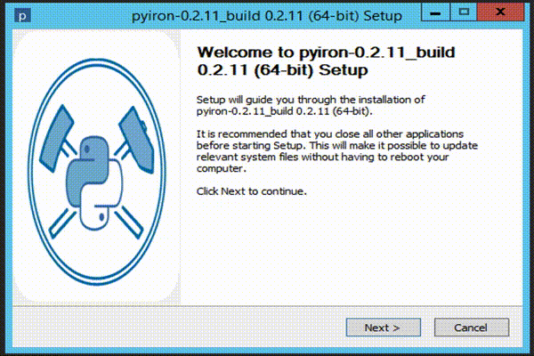

# Installers for pyiron 
[](https://github.com/pyiron/pyiron-installer/actions)

Download the release: 

https://github.com/pyiron/pyiron-installer/releases



# Remark 
After the installation completed successfully it is necessary to activate the installation: 

## Windows 
Open a command prompt and enter:
```
activate 
```  
## Linux/ MacOS 
Open a terminal and enter: 
```
source activate
```
